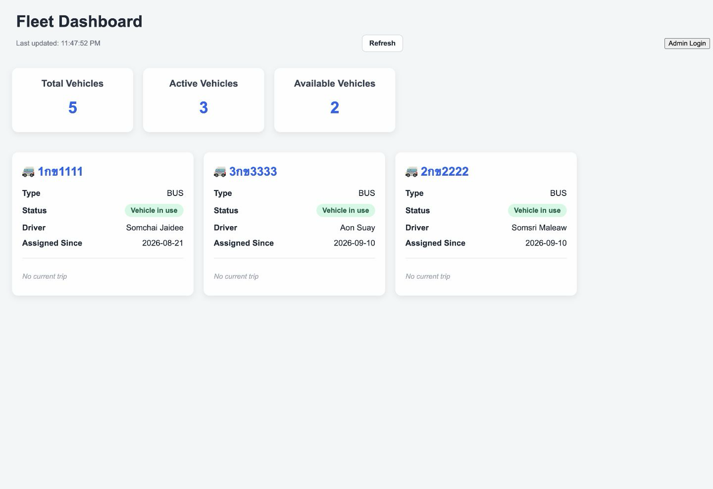
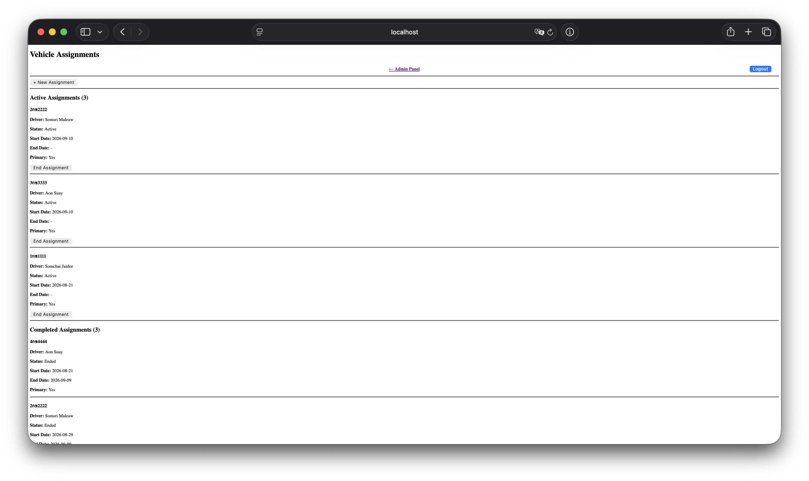
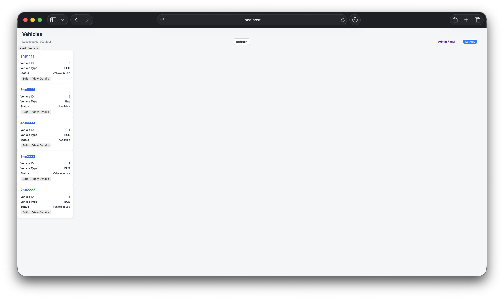

# Fleet Management System

A web application for managing vehicles, drivers, customers, and vehicle assignments.

I started this project while learning Java and Spring Boot. The idea came from a real employee transportation business, so I wanted to build something that could solve real problems, not only a tutorial project.

The project is still in development.

> All information shown in the screenshots is test data.

## Dashboard

The dashboard shows the current fleet status.

It shows:

- Total vehicles
- Vehicles currently in use
- Available vehicles
- Assigned drivers
- Current trip information when available

## Main Features

The system currently supports:

- Vehicle management
- Driver management
- Customer management
- Vehicle assignments
- Routes
- Trip lifecycle
- Admin login
- Dashboard
- REST APIs
- Input validation
- Automated tests

## How It Works

The backend uses a layered structure:

Browser - Controller - Service - Repository - PostgreSQL

Controllers handle requests.
Services contain the main business rules.
Repositories handle database access.

#Vehicle Assignments

Vehicle assignment is one of the main parts of the project.

For example:
- A vehicle cannot have two active assignments.
- A driver cannot have two active assignments.
- Only available vehicles can be assigned.
- Only active drivers can be assigned.
- When an assignment ends, the vehicle becomes available again.
- Completed assignments are kept as history.
  
These rules are handled in the backend and covered by tests.

#Vehicle Management

Vehicles can have different statuses such as available, in use, maintenance, or inactive.

Vehicle status is also used by other parts of the system. For example, a vehicle that is already in use cannot be selected for a new assignment.

#Trip Lifecycle

Trips have a simple lifecycle:
SCHEDULED
    ↓
TO_PICKUP
    ↓
IN_PROGRESS
    ↓
COMPLETED

The backend checks the current status before allowing a trip to move to the next status.

#Tech Stack
- Java 21
- Spring Boot
- Spring MVC
- Spring Data JPA
- Spring Security
- PostgreSQL
- Flyway
- Thymeleaf
- HTML / CSS / JavaScript
- Maven
- JUnit
- Mockito
- Testcontainers
- Docker
- Git

#Testing

I use automated tests to check business rules and application behavior.

Tests currently cover areas such as:
- Vehicle and driver rules
- Vehicle assignments
- Trip status changes
- Route validation
- Dashboard behavior
- Controllers
- PostgreSQL repository integration

#Current Status

The project is still under development.
I am currently focusing on improving the existing foundation before adding larger features.

Some future areas include:
- Better security and authorization
- Database and migration improvements
- Maintenance management
- Operating expenses
- More complete trip management
- Production deployment
  
#What I Learned

This project helped me understand that backend development is more than CRUD.

I learned more about:
- Designing business rules
- Separating controller, service, and database responsibilities
- Working with PostgreSQL
- Managing application state
- Writing automated tests
- Thinking about security and data integrity
- Building software step by step
  
#Source Code

The main development repository is private.
This repository is a public overview of the project for my portfolio.
